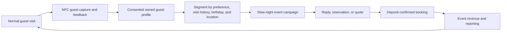

# RateTap event-revenue growth strategy

**Working position:** *We fill your slow nights from guests you already have.*

**Commercial outcome:** attributable event revenue booked from a restaurant's owned guest list.

**Status of numbers:** Every price, conversion rate, capacity figure, and revenue scenario in this document is an estimate until proven with campaign and deposit data. The strategy deliberately separates what the product can do now from what must be added before performance pricing is safe.

---

## 1. Executive decision

RateTap should stop leading with review capture, NFC cards, staff leaderboards, or “reputation management.” Those features are useful, but they describe machinery rather than an owner-level result.

The new pitch is:

> RateTap turns the guests already visiting your restaurant into a measurable event-revenue channel. We help choose a slow date, segment the right guests, run the WhatsApp campaign, move interested guests into a quote or reservation, and show how much revenue was booked. Review capture, guest data, and NFC cards are included because they continuously grow the audience.

This turns RateTap from a low-priced restaurant SaaS tool into an operated revenue service with proprietary software underneath it.

The operating loop is:

The flywheel is the product. Reviews are one capability inside it, not the headline.

---

## 2. The customer problem in owner language

Restaurant groups typically have four disconnected assets:

1. Empty or underused capacity on predictable nights.
2. Thousands of past guests, but no organized way to reactivate them.
3. Staff who know regulars personally, but whose knowledge is not captured in a reusable system.
4. Event menus and banquet capacity, but an inconsistent inquiry-to-deposit process.

Most marketing vendors propose buying more attention through ads, influencers, discounts, or delivery platforms. RateTap should sell a different idea: monetize demand the restaurant already earned.

The owner is not buying “CRM access” or “more reviews.” The owner is buying a repeatable answer to:

> What are we doing to put paying guests into this restaurant next Tuesday or Thursday?

That is concrete, urgent, financially legible, and easy to discuss at the group level.

---

## 3. Ideal customer profile

### Best initial customer

The strongest first customer is a restaurant group or high-volume independent that has:

- one or more predictably slow Tuesday–Thursday service periods;
- enough capacity to add 20–80 event guests without damaging normal service;
- a premium enough ticket or event package for one filled night to matter;
- an existing guest list, loyalty list, reservation database, or a realistic way to build one quickly;
- explicit marketing consent and usable WhatsApp numbers for the audience being contacted;
- a manager who can answer interested guests and confirm availability;
- an existing deposit method such as SPEI, a restaurant-owned payment link, or an in-person payment process;
- an owner or operations leader willing to share booking and collected-revenue truth.

### Strong buying signals

- The owner already runs wine dinners, tastings, holiday menus, live music, birthday packages, corporate meals, or private events.
- The group has good traffic on weekends but visibly weak midweek demand.
- Event inquiries are handled manually across multiple WhatsApp accounts.
- Quotes exist, but follow-up and deposit status are inconsistent.
- The restaurant collects guest phone numbers but rarely reactivates them.
- The operator can describe an empty-night problem in pesos.

### Disqualifiers

Do not sell the managed performance offer when:

- there is no contactable, consented audience and no plan to build one;
- the restaurant is already full on the proposed event night;
- management will not use deposits or record confirmed bookings;
- nobody owns replies and availability decisions;
- the venue cannot deliver the event operationally;
- the owner refuses to share booking, cancellation, and collected-revenue records;
- the offer depends on aggressive discounting that destroys contribution margin;
- the restaurant wants a guarantee before approving the date, offer, staff, inventory, or follow-up process.

These are not minor onboarding issues. They make attribution or delivery impossible.

---

## 4. The offer architecture

### Tier 1 — Software

**Price estimate:** MXN $1,500 setup + MXN $700/month.

**Purpose:** a low-friction anchor and a self-serve option, not the main growth engine.

**Includes:**

- NFC/QR guest feedback and review-capture flow;
- staff and location performance views;
- guest profile capture;
- visit history and basic segmentation;
- consent records and CSV export;
- access to event lead and quote tools where applicable;
- campaign templates and a self-serve checklist.

**Does not include:**

- campaign strategy;
- event concept or offer creation;
- list cleaning or segmentation by RateTap;
- WhatsApp campaign preparation or operation;
- reply handling, quoting, or follow-up;
- revenue attribution or monthly campaign reporting;
- custom creative or custom integrations.

The boundary must be explicit. At MXN $700/month, one hour of recurring manual service can erase the economics.

**Best fit:** an operator who wants the tools and has someone internally who will run them.

### Tier 2 — Growth

**Price estimate:** MXN $15,000 setup + MXN $10,000/month.

**Purpose:** the default commercial product.

**Promise:** one fully prepared, measured slow-night campaign per month, using the restaurant's owned audience.

**Setup includes:**

- one-location revenue and capacity baseline;
- guest-list import, deduplication, and consent audit;
- audience segmentation plan;
- event economics worksheet: date, capacity, ticket/package, break-even, minimum viable bookings, and maximum bookings;
- campaign tracking and attribution setup;
- one reusable event/offer template;
- WhatsApp copy and follow-up scripts;
- quote and deposit workflow configuration;
- staff training for response, availability, and booking confirmation;
- a campaign calendar and named owners on both sides.

**Monthly delivery includes:**

- selection of one target slow night and one event offer;
- audience selection and suppression rules;
- campaign copy, send waves, and follow-up sequence;
- a prepared WhatsApp queue or approved API campaign, depending on the restaurant's setup;
- reply and hot-lead workflow;
- quote/reservation tracking;
- booking and deposit reconciliation;
- one post-campaign performance report;
- one 30-minute results and next-event review.

**Scope boundary:** one location, one event concept, and one campaign per month unless the proposal says otherwise. Extra locations or campaigns are add-ons. RateTap does not become the restaurant's general marketing department for MXN $10,000/month.

**Restaurant responsibilities:**

- approve the event, date, price, menu, capacity, and terms;
- provide accurate availability and guest data;
- use only contactable audiences that meet its consent requirements;
- respond to interested guests within the agreed service level;
- collect deposits as merchant of record;
- mark bookings, cancellations, refunds, and final revenue accurately;
- deliver the event.

### Tier 3 — Partner

**Price estimate:** MXN $15,000 setup + 12% of attributable event revenue.

**Purpose:** remove performance risk for a small number of qualified design partners while RateTap proves the model.

This should not be an unrestricted pricing-page option. If Growth and Partner contain the same work, Partner costs less than a MXN $10,000 retainer whenever monthly attributable revenue is below approximately MXN $83,333. It also transfers campaign risk to RateTap. Most rational buyers would choose it first.

Use Partner under these rules:

- invitation-only;
- maximum of three to five active design partners initially;
- one location and one campaign per month;
- 90-day initial term;
- minimum contactable audience and event capacity agreed before signing;
- complete campaign, booking, deposit, cancellation, and revenue tracking required;
- restaurant response-time and operational obligations written into the agreement;
- explicit option to move to Growth after the proof period;
- RateTap may decline a campaign when the offer, capacity, economics, consent, or operational readiness is inadequate.

Partner is a proof and case-study mechanism. Growth should become the long-term default once the restaurant has seen repeatable revenue.

---

## 5. What exactly RateTap operates

“Campaign run for them” is too vague. The service must be a repeatable production line.

### Step 1 — Find the revenue gap

For the target location, record:

- the weak day and service period;
- normal covers and available capacity;
- normal average spend;
- labor already scheduled versus incremental labor required;
- the event's sellable capacity;
- the minimum bookings required to make the event worthwhile;
- the ceiling beyond which service quality degrades.

The baseline prevents RateTap from taking credit for a night that would have filled anyway.

### Step 2 — Design one sellable occasion

An event needs a reason to happen now. “Come to dinner” is not an event.

Possible formats include:

- wine or spirits pairing dinner;
- chef's menu or regional tasting;
- birthday-month celebration package;
- anniversary or couples' dinner;
- business dinner package;
- private group menu for 20–60 guests;
- holiday or seasonal event;
- regulars-only preview or club night.

Every offer must specify:

- date and start time;
- clear experience and inclusions;
- price per person or group;
- capacity;
- deposit requirement;
- cancellation policy;
- urgency or scarcity that is true;
- a single booking action.

Avoid open-ended discounts. A packaged occasion protects brand perception and makes revenue easier to attribute.

There are two distinct plays under the same revenue position:

| Play | What is being sold | Funnel | Best first use |
|---|---|---|---|
| **House-event seat fill** | Seats or tables for one restaurant-created event on one date | guest segment → WhatsApp → reservation → deposit → attendance | Wine dinner, tasting, chef's menu, or other slow-night event |
| **Private-event pipeline** | A birthday, corporate meal, anniversary, or group booking | guest signal → inquiry → qualification → quote → deposit → event | Restaurants with mature banquet menus and staff who can close custom bookings |

Start with house-event seat fill. The offer, date, price, capacity, and attribution window are fixed, which makes the first proof much cleaner. Add the private-event pipeline after response ownership and quote follow-up are working reliably.

### Step 3 — Build the segment

Rank the audience by intent instead of blasting everyone at once.

For a wine dinner, for example:

1. guests who redeemed or selected a wine preference;
2. frequent guests and recent repeat visitors;
3. guests with a birthday or anniversary near the date;
4. other consented guests from the same location;
5. a broader brand-level audience only if capacity remains.

Snapshot the segment before launch. The snapshot is essential for attribution, reporting, and avoiding accidental repeat contact.

### Step 4 — Run controlled send waves

A recommended operating pattern is:

- **Wave 1:** highest-intent segment, personal tone, early access;
- **Wave 2:** next-best segment after measuring first-wave bookings;
- **Follow-up:** only non-responders or interested guests who have not deposited;
- **Final availability message:** only when genuine capacity remains.

Do not treat opening a `wa.me` link as a sent message. Today the restaurant employee still presses Send; production reporting must distinguish *prepared*, *opened*, *sent*, *replied*, *quoted*, *deposited*, and *attended*.

### Step 5 — Turn interest into a booking

The close sequence should be standardized:

1. Confirm party size and availability.
2. Send the relevant reservation summary or quote.
3. State the deposit and deadline clearly.
4. Send the restaurant's payment instructions.
5. Confirm deposit receipt.
6. Record the booking value and party size.
7. Send reminder and event details.
8. Reconcile cancellations, no-shows, additions, and final revenue.

The restaurant remains merchant of record and should receive guest funds directly. RateTap should not route event deposits through its existing SaaS Stripe account.

### Step 6 — Report in pesos

The owner report should open with:

- attributed revenue booked;
- attributed revenue collected;
- deposits collected;
- seats or group bookings confirmed;
- remaining event capacity;
- RateTap fee;
- net revenue after RateTap fee;
- estimated contribution margin as an operational guardrail;
- comparison with the agreed baseline.

Message-level metrics belong below the money, not above it.

---

## 6. Attribution and the revenue definition

Performance pricing will fail if “attributed event revenue” is not defined before the campaign.

### Market on booked revenue; bill on collected revenue

The owner-facing value metric can remain **event revenue booked**. The performance fee should be calculated on **Net Collected Attributable Event Revenue** so RateTap is not paid on cancelled quotes, unpaid reservations, refunds, tips, or tax.

Suggested commercial definition:

> Net Collected Attributable Event Revenue means cash actually received by the restaurant for eligible event bookings originating from a RateTap campaign, excluding IVA, gratuities, service charges, refunds, chargebacks, complimentary items, and revenue already present in the restaurant's active pipeline before campaign launch.

This is commercial drafting, not legal or tax advice; the final agreement should be reviewed locally.

### An eligible attributed booking should require all of the following

- the guest was included in the frozen campaign audience or arrived through the campaign's unique booking route;
- the inquiry, reservation, or quote carries the campaign ID;
- no matching active event opportunity existed before campaign launch;
- the deposit was received inside the agreed attribution window, for example 30 days;
- the booking is for the promoted event or agreed event product;
- the restaurant records the amount and deposit truth;
- cancellations and refunds are deducted in the next reconciliation.

### Attribution hierarchy

1. **Direct:** unique tracked link, booking code, or quote created from the campaign.
2. **Matched:** the campaign recipient's normalized phone matches the deposited booking.
3. **Assisted:** staff records the campaign as the source and RateTap can verify timing and contact history.
4. **Organic/control:** no campaign evidence; excluded from performance billing.

When in doubt, exclude the booking from the fee. A trusted attribution system is worth more than squeezing one disputed commission.

### Monthly reconciliation

Each month, both sides review a line-item ledger containing:

- campaign;
- guest or booking reference;
- event date;
- booking date;
- quoted amount;
- deposit amount and date;
- collected amount;
- cancellation/refund adjustments;
- eligible revenue;
- fee calculation;
- owner approval status.

The ledger, not a dashboard screenshot, is the source of truth for invoicing.

---

## 7. Economics and pricing logic

### Illustrative event math

Using the current MXN $1,599 per-person example:

| Paid seats | Gross event revenue | 12% Partner fee | Revenue after RateTap fee, before food/labor/tax |
|---:|---:|---:|---:|
| 20 | MXN $31,980 | MXN $3,838 | MXN $28,142 |
| 40 | MXN $63,960 | MXN $7,675 | MXN $56,285 |
| 60 | MXN $95,940 | MXN $11,513 | MXN $84,427 |
| 80 | MXN $127,920 | MXN $15,350 | MXN $112,570 |

These are gross-revenue illustrations. They do not prove incrementality, profitability, attendance, or the size of the contactable list.

### Why MXN $10,000/month can work

At 40 paid seats, the Growth retainer equals about 15.6% of MXN $63,960 in event revenue. If the campaign repeatedly produces more than MXN $83,333 per month, the fixed retainer is cheaper for the buyer than a 12% fee.

The sales logic becomes:

- use Partner selectively when the buyer needs proof and qualifies for shared risk;
- use the result to establish a trusted revenue baseline;
- move repeatable accounts to Growth so the buyer receives predictable cost and RateTap receives predictable margin.

### The list-size test

The most important unknown is not the ticket price; it is the number of paid seats produced per eligible contacted guest. For a 40-seat target:

| Paid seats per contacted guest | Eligible contacts required for 40 seats |
|---:|---:|
| 2% | 2,000 |
| 5% | 800 |
| 10% | 400 |

These are sensitivity cases, not conversion benchmarks. Party size can improve the effective seat yield, while poor consent, stale numbers, a weak offer, or slow follow-up can reduce it. The first campaigns must measure this variable by segment.

Use four formulas in every audit:

1. `gross event revenue = paid seats × collected price per seat`
2. `eligible performance-fee base = collected attributed revenue − agreed exclusions and adjustments`
3. `RateTap Partner fee = eligible fee base × 12%`
4. `estimated event contribution = collected revenue − food/beverage cost − incremental event labor − entertainment/creative − RateTap fee`

The owner buys revenue growth, but RateTap should not recommend an event that fails the contribution test.

### Portfolio examples

All examples assume one campaign per group per month and exclude setup fees:

| Portfolio | Illustrative monthly RateTap revenue |
|---|---:|
| 5 Growth clients | MXN $50,000 |
| 5 Partner clients, each at MXN $63,960 attributed revenue | about MXN $38,376 |
| 3 Growth + 2 Partner at MXN $63,960 each | about MXN $45,350 |
| 10 Growth clients | MXN $100,000 |

Operational capacity is the constraint. If one campaign takes an estimated 8–12 human hours, five accounts require roughly 40–60 delivery hours per month before sales, support, and product work. Track actual delivery time from the first pilot.

### Setup fee rationale

The MXN $15,000 setup fee is not an arbitrary activation charge. It pays for work that has lasting value:

- data cleanup and import;
- consent and suppression setup;
- baseline and event economics;
- segmentation;
- tracking configuration;
- quote/deposit workflow;
- staff training;
- first event template.

Do not waive it casually. Waiving setup attracts operators who have no internal commitment and leaves RateTap holding all implementation risk.

---

## 8. Free versus paid

### Always free

**Slow-Night Revenue Audit**

The audit should estimate:

- which service period appears underused;
- available event capacity;
- current guest-list readiness;
- consented/contactable audience size;
- top audience segments;
- one event concept;
- illustrative seat and revenue opportunity;
- operational and attribution gaps;
- whether a paid campaign is ready now or guest capture must come first.

The audit should not promise a revenue number from public information alone. The restaurant must provide real capacity, ticket, margin, list, and baseline data.

**Software trial**

- limited to one location;
- time-boxed, for example 30 days;
- no custom implementation;
- no managed campaign included;
- success means the team actually captures usable guest profiles and can operate the core workflow.

### Paid

Charge for the operated campaign: strategy, segmentation, event packaging, send plan, follow-up system, quote/deposit tracking, attribution, and reporting.

### Limited proof campaign

If outside proof is still required, offer no more than three design-partner pilots with strict boundaries:

- one location;
- one event;
- one audience segment plus one follow-up;
- restaurant approves and funds the event;
- restaurant sends messages from its account unless an approved API setup exists;
- restaurant handles availability and deposits;
- attribution access is mandatory;
- a decision meeting and paid conversion options are scheduled before launch;
- case-study permission is requested if the result is successful;
- the waived campaign fee is shown explicitly on the proposal so the work retains a price.

Do not make “free first campaign” the standard offer. A free software trial demonstrates the tool; a managed event campaign consumes real labor and produces owner-visible value.

---

## 9. The first proof: La Estancia wine dinner

The current VIP wine-dinner flow is the right internal wedge because it already has:

- a defined experience;
- a date and time;
- an MXN $1,599 ticket;
- a location-specific guest list;
- wine-preference and visit-frequency segmentation;
- WhatsApp message preparation;
- a limited-capacity close;
- a deposit ask.

Treat it as a controlled case study, not merely a send list.

### Before launch

Record:

- event capacity;
- expected organic bookings without the campaign;
- minimum viable paid seats;
- total eligible and consented audience;
- audience by segment;
- exact deposit amount and payment method;
- response owner and response-time target;
- campaign ID and attribution window.

### During the campaign

Track:

- guests queued;
- messages actually sent;
- replies;
- positive replies;
- reservation requests;
- deposit instructions sent;
- deposits received;
- seats confirmed;
- revenue booked and collected;
- cancellations and waitlist.

### After the event

Produce a one-page case study:

> We contacted X eligible guests, received Y replies, confirmed Z paid seats, and collected MXN $R in attributable event revenue for a normally weaker Thursday. The campaign required H staff hours and the restaurant retained MXN $N after the RateTap fee, before event costs.

Do not claim RateTap raised Google ratings or prevented negative reviews. The revenue proof should stand on its own.

---

## 10. Pilot operating calendar

### Four weeks before the event

- choose the slow date;
- confirm capacity, menu, ticket, deposit, and break-even;
- freeze baseline and existing pipeline;
- assign RateTap and restaurant owners.

### Three weeks before

- clean and segment the audience;
- build the campaign record and tracking;
- prepare the booking/quote and payment instructions;
- train the response owner;
- approve copy.

### Two weeks before

- launch Wave 1 to the highest-intent segment;
- monitor replies and deposits daily;
- fix offer or operational friction before broadening reach.

### Ten to seven days before

- launch Wave 2 if capacity remains;
- follow up with interested non-depositors;
- report seats, revenue, capacity, and blockers.

### Final three days

- send truthful last-availability messaging only if seats remain;
- confirm paid guests;
- stop acquisition when capacity is reached;
- issue reminders and event instructions.

### One to three days after

- reconcile attendance, additions, cancellations, refunds, and final collected revenue;
- calculate the fee from the agreed ledger;
- document lessons and approve the next event.

---

## 11. The dashboard that owners should see

### Primary money metrics

- event revenue booked;
- event revenue collected;
- deposit-confirmed seats or group bookings;
- incremental revenue versus baseline;
- RateTap fee;
- revenue retained after RateTap fee;
- estimated contribution margin;
- cancellation/no-show rate.

### Funnel metrics

- eligible consented audience;
- messages actually sent;
- reply rate;
- qualified-interest rate;
- quote/reservation rate;
- deposit conversion rate;
- revenue per 100 contacted guests;
- average booking value;
- days from first message to deposit.

### Operating metrics

- response time to hot leads;
- follow-ups completed;
- campaign delivery hours;
- staff ownership gaps;
- list growth since the previous campaign;
- opt-outs and contact fatigue.

The headline is pesos. Funnel metrics exist to explain why the pesos moved.

---

## 12. Sales narrative and copy

### One-line English position

> We fill your slow nights using guests you already have—and show you the event revenue booked.

### One-line Spanish position

> Llenamos tus noches flojas con los clientes que ya tienes y te mostramos cuántos pesos se reservaron.

### 30-second owner pitch in Spanish

> RateTap ya no es solo una herramienta para pedir reseñas. Convierte a los clientes que ya visitan tu restaurante en una base propia para llenar fechas flojas. Elegimos una noche, diseñamos el evento, segmentamos a los clientes correctos, preparamos la campaña por WhatsApp, ayudamos a llevar cada interesado a reservación o cotización y medimos los anticipos. Tú ves cuántos pesos se reservaron. Las tarjetas NFC y las reseñas vienen incluidas porque son la forma de seguir haciendo crecer la base.

### Audit opener

> No te quiero vender anuncios ni otra plataforma. Quiero calcular una sola cosa: cuánto podría valer una noche floja si reactivamos a los clientes que ya te conocen. Si no hay base, capacidad o forma de medir los anticipos, te lo digo en el diagnóstico y no te vendo la campaña.

### Proposal close

> Empezamos con una sucursal, una fecha y una campaña. Antes de enviar nada dejamos por escrito la capacidad, el precio, la base elegible y cómo se atribuye cada reservación. Al final no te presento impresiones; te presento anticipos y ventas cobradas.

### What not to lead with

- “Get more five-star reviews.”
- “NFC review cards.”
- “AI reputation management.”
- “A CRM for restaurants.”
- “A staff leaderboard.”
- “Prevent bad reviews.”

Those statements either commoditize the product, describe a feature, or create claims that are difficult to prove. The owner-level result is monetized guest demand.

---

## 13. Objections

### “We already post events on Instagram.”

> Keep doing it. Instagram is rented reach and difficult to attribute. This campaign activates named guests you already served and connects each booking to a deposit and revenue record.

### “We already use WhatsApp.”

> WhatsApp is the channel. The product is the system around it: audience, segment, offer, send waves, follow-up, quote, deposit, and revenue reconciliation.

### “Our staff can send the messages.”

> They should remain involved, especially while messages come from the restaurant's own account. RateTap removes the planning, segmentation, copy, tracking, and reporting work that normally makes the campaign inconsistent.

### “Twelve percent is too much.”

> Then use the fixed Growth plan. The performance model is for operators who want RateTap to share the risk. The fee applies only to eligible, collected, attributed revenue under the agreed definition.

### “What if it does not work?”

> We start with one location, one event, and a documented baseline. We can see whether the problem was audience size, offer, response time, deposit friction, or demand. We do not ask the group to roll out before the first loop is proven.

### “Can you guarantee the event fills?”

> No honest operator can guarantee demand without controlling the offer, audience, price, capacity, follow-up, and restaurant execution. We can guarantee the campaign process, attribution, reporting, and agreed delivery scope.

### “Why do we need the NFC cards?”

> You do not buy them as the headline. They are the always-on mechanism that captures new guest profiles and preferences so each future event has a larger owned audience.

---

## 14. Product gaps before charging 12%

The current product contains much of the operating chain, but performance billing needs stricter infrastructure.

### Already present in the product

- guest profiles with WhatsApp, preferences, birthday, consent, and visit history;
- a location-specific VIP segmentation interface;
- prepared WhatsApp outreach;
- event lead intake from WhatsApp/manual sources;
- lead claiming and `new → claimed → quoted → won/lost` lifecycle;
- quote creation, public quote links, and WhatsApp sharing;
- quote-to-lead linkage;
- a restaurant-owned deposit direction in the product plan.

### P0 — required before external performance billing

1. **Campaign records:** campaign ID, venue, event, capacity, price, baseline, launch date, and attribution window.
2. **Frozen campaign audience:** exactly who was eligible and why.
3. **Consent enforcement:** suppress guests without the required marketing consent and maintain an opt-out list. A warning badge alone is not enough.
4. **Server-side contact state:** replace device-local `localStorage` as the source of send truth.
5. **Message-state honesty:** distinguish prepared/opened from actually sent.
6. **Campaign-linked inquiries:** connect each reply, reservation, event lead, and quote to campaign and guest.
7. **Booking and revenue fields:** party size, booked amount, deposit amount/date, collected amount, event date, cancellation, refund, and attendance.
8. **Revenue reconciliation ledger:** line-item owner approval and fee calculation.
9. **Existing-pipeline exclusion:** freeze opportunities that predate the campaign.
10. **Role and access controls:** guest PII and revenue must remain location/brand scoped.

### P1 — scale after two or three proven campaigns

- campaign templates by event type;
- contact-frequency limits and fatigue monitoring;
- automated follow-up reminders;
- capacity and waitlist management;
- approved WhatsApp Business API templates where justified;
- tracked booking links and reply ingestion;
- campaign comparison and cohort reporting;
- operator delivery-time tracking;
- multi-location audience controls.

### P2 — demand-pulled only

- Stripe Connect Standard for restaurant-owned card deposits;
- POS or reservation-system reconciliation;
- automated application-fee collection;
- more advanced experimentation and forecasting.

Do not build payments infrastructure before restaurants prove they will run and pay for the campaign system.

---

## 15. Risks and guardrails

### Attribution disputes

**Risk:** restaurant believes a booking was organic; RateTap bills it as influenced.

**Guardrail:** frozen baseline, unique campaign IDs, line-item reconciliation, conservative exclusion when evidence is weak.

### Consent and WhatsApp account health

**Risk:** messaging guests without the required consent creates complaints, opt-outs, or account restrictions.

**Guardrail:** consent-based eligibility, frequency caps, suppression, small waves, truthful identity, and a clear opt-out process. Obtain local compliance advice for each sending setup.

### Revenue without profit

**Risk:** a filled event looks good in gross revenue but loses money through discounts, free product, or incremental labor.

**Guardrail:** price the service on attributed revenue for simplicity, but require an event contribution-margin worksheet as a launch gate.

### Restaurant execution failure

**Risk:** slow replies, unclear availability, or deposit friction destroys conversion.

**Guardrail:** named response owner, agreed service level, scripts, daily hot-lead review, and loss-reason tracking.

### Campaign fatigue

**Risk:** the same guests receive repetitive offers and disengage.

**Guardrail:** preference-led segments, contact frequency limits, rotating concepts, and list growth through normal visits.

### Managed-service sprawl

**Risk:** RateTap becomes responsible for design, photography, ads, social media, menu engineering, customer support, and event operations under one small retainer.

**Guardrail:** one campaign, one venue, one report, explicit add-ons, and a written responsibility matrix.

### Partner-plan downside

**Risk:** RateTap does substantial work and earns little because the operator was not ready.

**Guardrail:** qualification gates, paid setup, 90-day term, account cap, and the right to reject unready campaigns.

---

## 16. 90-day execution plan

### Days 1–14 — instrument the internal proof

- create a campaign ID and audience snapshot for the wine dinner;
- enforce a consented-audience view;
- define capacity, baseline, deposit, and revenue fields;
- move contact status from the device into persistent records;
- create a simple booking/deposit ledger;
- assign the restaurant response owner.

### Days 15–30 — run and reconcile one complete loop

- launch controlled audience waves;
- track replies, reservations, deposits, and seats daily;
- reconcile final collected revenue;
- record actual RateTap and restaurant labor;
- produce the first owner-facing report.

### Days 31–45 — turn proof into the sales product

- write the case study with exact, defensible numbers;
- finalize the Slow-Night Revenue Audit;
- finalize Growth and design-partner proposal templates;
- create the attribution schedule and responsibility matrix;
- update site and sales copy around slow-night revenue.

### Days 46–75 — sell three controlled pilots

- approach groups that already run events and have an owned list;
- qualify data, consent, capacity, deposit process, and response owner before proposal;
- sell Growth by default;
- use Partner only when the account passes every gate and the proof value justifies shared risk;
- do not exceed delivery capacity.

### Days 76–90 — decide whether the model is real

Evaluate:

- number of qualified audits;
- paid setups closed;
- campaigns launched;
- attributable revenue collected;
- delivery hours per campaign;
- restaurant response-time failures;
- gross margin after delivery labor;
- renewal/next-campaign commitments;
- number and severity of attribution disputes.

### Go/no-go criteria

Continue investing if the first campaigns show:

- owner-visible, deposit-backed revenue;
- repeatable campaign delivery;
- a plausible path to healthy service gross margin;
- restaurant willingness to pay after proof;
- reliable attribution with minimal disputes;
- demand for another event, not just compliments about the software.

Pause or narrow the offer if campaigns require heavy custom work, restaurants will not share booking truth, consented audiences are too small, or revenue only appears when the event is deeply discounted.

---

## 17. Final commercial recommendation

1. Keep Software as a tightly bounded self-serve anchor.
2. Make Growth the default offer and define it as one operated, measured campaign per month.
3. Treat Partner as an invitation-only 90-day proof mechanism, capped at a few accounts.
4. Sell on **event revenue booked** but calculate the performance fee on **net collected attributable event revenue**.
5. Prove the whole loop internally with the La Estancia wine dinner before making external performance claims.
6. Add campaign, consent, booking, deposit, and revenue-ledger infrastructure before charging 12%.
7. Give away diagnosis and software access; do not routinely give away human-operated campaigns.
8. Lead every sales conversation with the slow night, the owned audience, and the pesos—not reviews.

The sharpest version of the business is not “review software for restaurants.” It is:

> **An owned-audience revenue operator for restaurants, powered by the guest data RateTap captures every day.**
